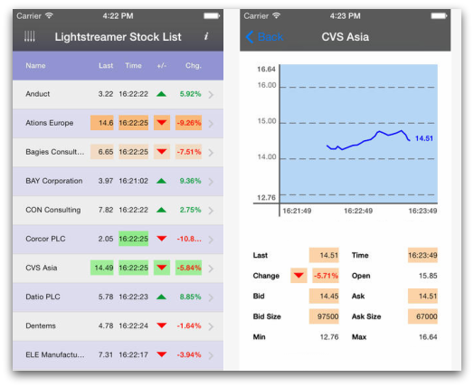

# Lightstreamer - Stock-List Demo - iOS Client

<!-- START DESCRIPTION lightstreamer-example-stocklist-client-ios -->

This project contains an example of an application for iPhone and iPad that employs the [Lightstreamer iOS Client library](http://www.lightstreamer.com/api/ls-ios-client/latest/).

A version with full support for mobile push notifications (MPN) is also available: [Lightstreamer - Stock-List Demo with APNs Push Notifications - iOS Client](https://github.com/Lightstreamer/Lightstreamer-example-MPNStockList-client-ios).

## Live Demo

[](https://itunes.apple.com/us/app/lightstreamer-stock-list/id930445387?mt=8)<br>
### [ View live demo](https://itunes.apple.com/us/app/lightstreamer-stock-list/id930445387?mt=8)<br>

## Details

This app, compatible with both iPhone and iPad, is an Objective-C version of the [Stock-List Demos](https://github.com/Lightstreamer/Lightstreamer-example-Stocklist-client-javascript).<br>

This app uses the <b>iOS Client API for Lightstreamer</b> to handle the communications with Lightstreamer Server. A simple user interface is implemented to display the real-time data received from Lightstreamer Server.<br>

## Install

Binaries for the application are not provided, but it may be downloaded from the App Store at [this address](https://itunes.apple.com/us/app/lightstreamer-stock-list/id930445387?mt=8). The downloaded app will connect to Lightstreamer's online demo server.

## Build

A full Xcode project specification, ready for compilation of the app sources, is provided. Please recall that you need a valid iOS Developer Program membership to run or debug your app on a test device.

### Getting Started

Before you can build this demo, you need to install CocoaPods to handle the project dependency on the Lightstreamer iOS client library. Follow these steps:

* open a terminal and run the following command:

```sh
$ sudo gem install cocoapods
```

* `cd` into the directory where you downloaded this project and run the following command:

```sh
$ pod install
```

* CocoaPods should now resolve the dependency on the Lightstreamer iOS client library and prepare a workspace for you.

Done this, open the workspace with Xcode and it should compile with no errors. In case of errors during dependency resolution, you can find more information on [CocoaPods official website](https://cocoapods.org).

### Compile and Run

* Create an *app ID* on the [Apple Developer Center](https://developer.apple.com/membercenter/index.action).
* Create and install an appropriate provisioning profile for the app ID above and your test device, on the Apple Developer Center.
* Set the app ID above as the *Bundle Identifier* of the Xcode project of the app.
* Set the IP address of your local Lightstreamer Server in the constant `PUSH_SERVER_URL`, defined in `Shared/Constants.h`; a ":port" part can also be added.
* Follow the installation instructions for the Data and Metadata adapters required by the demo, detailed in the [Lightstreamer - Stock-List Demo - Java Adapter](https://github.com/Lightstreamer/Lightstreamer-example-StockList-adapter-java) project.

Done this, the app should run correctly on your test device and connect to your server.

## See Also

### Lightstreamer Adapters Needed by This Demo Client

* [Lightstreamer - Stock- List Demo - Java Adapter](https://github.com/Lightstreamer/Lightstreamer-example-Stocklist-adapter-java)
* [Lightstreamer - Reusable Metadata Adapters- Java Adapter](https://github.com/Lightstreamer/Lightstreamer-example-ReusableMetadata-adapter-java)

### Related Projects

* [Lightstreamer - Stock-List Demos - HTML Clients](https://github.com/Lightstreamer/Lightstreamer-example-Stocklist-client-javascript)
* [Lightstreamer - Stock-List Demo with APNs Push Notifications - iOS Client](https://github.com/Lightstreamer/Lightstreamer-example-MPNStockList-client-ios)
* [Lightstreamer - Stock-List Demo - Android Client](https://github.com/Lightstreamer/Lightstreamer-example-AdvStockList-client-android)
* [Lightstreamer - Basic Stock-List Demo - OS X Client](https://github.com/Lightstreamer/Lightstreamer-example-StockList-client-osx)
* [Lightstreamer - Basic Stock-List Demo - Windows Phone Client](https://github.com/Lightstreamer/Lightstreamer-example-StockList-client-winphone)

## Lightstreamer Compatibility Notes

* Compatible with Lightstreamer iOS Client Library version 2.0.0-a1 or newer.
* For Lightstreamer Allegro (+ iOS Client API support), Presto, Vivace.
* For a version of this example compatible with Lightstreamer iOS Client API version 1.x, please refer to [this tag](https://github.com/Lightstreamer/Lightstreamer-example-StockList-client-ios/tree/latest-for-client-1.x).
